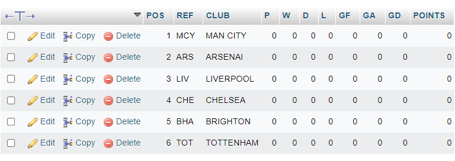
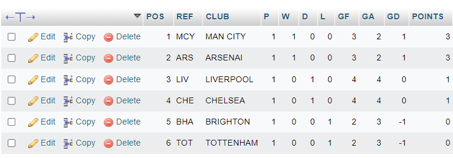
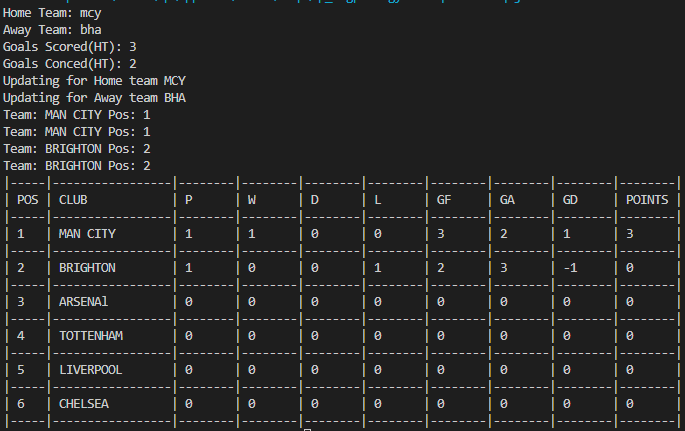
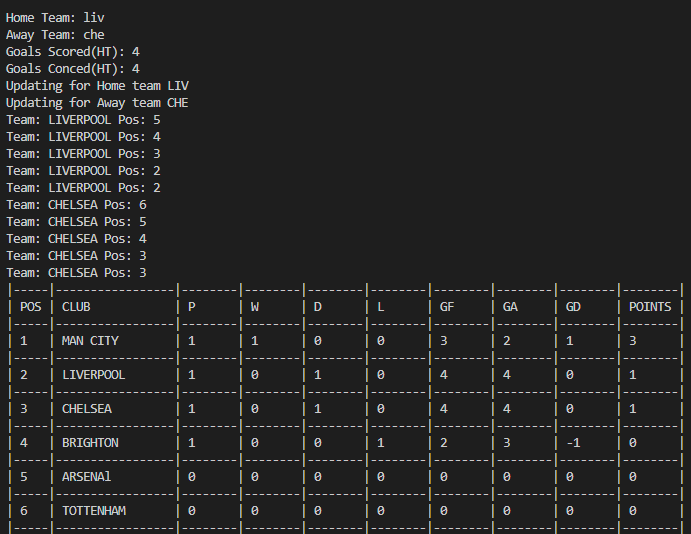
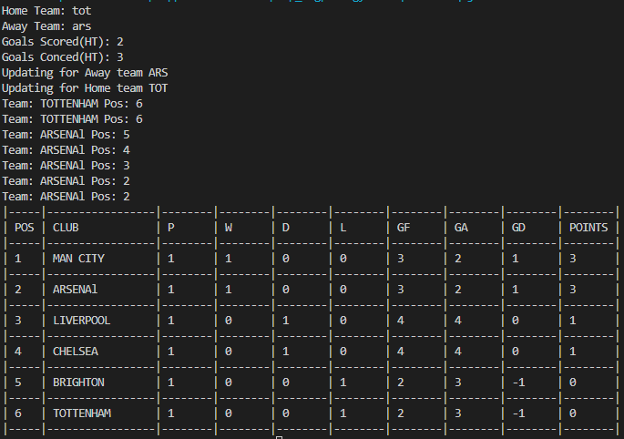

# FOOTBALL LEAGUE STANDING TABLE ARRANGEMENT SOFTWARE 

## Overview

### The challenge

Create a program in java that can re-arrange a football league table depending on the results of a match

- Table should be hosted in database
- If a team wins it should move accordingly up the table.
- If teams tie they should be arranged accordingly 
- If teams have the same point, the goal difference should be used to arrange them accordingly, else if teams have the same goal difference and points, the goals scored by each teams will be used for arrangment.

### Screenshot

